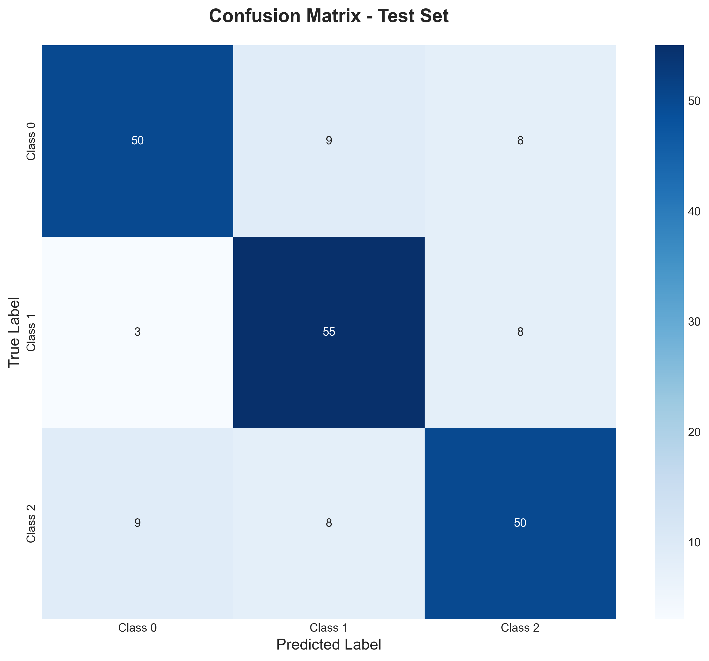
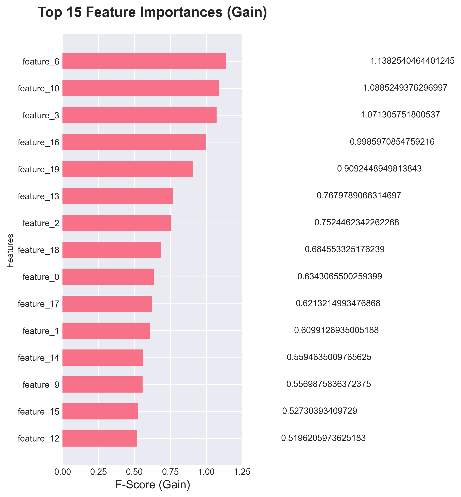

# High-Performance XGBoost Classifier Template

## 📋 Project Overview
**Developed a comprehensive, reusable Python template for implementing XGBoost (Extreme Gradient Boosting), one of the most powerful machine learning algorithms for tabular data.**

This project implements a gradient boosting classifier using a **3-Way Data Split (Train/Validation/Test)** and **Early Stopping** to prevent overfitting. It is designed as a professional-grade pipeline for predictive modeling.

---

## 📊 Key Results & Visualizations

### 1. Model Performance (Confusion Matrix)
The model was evaluated on an unseen test set. As shown below, the heatmap visualizes the True Positives vs. False Positives.

### 2. Feature Importance
Using the native XGBoost importance metrics, we identified which data points were the primary drivers for the model's decisions.

---

## 🛠 Tech Stack
* **Language:** Python 3.10+
* **Modeling:** XGBoost, Scikit-Learn
* **Data Manipulation:** Pandas, NumPy
* **Visualization:** Seaborn, Matplotlib

---

## 🔒 Source Code Access
*This repository serves as a showcase of the project's methodology and results.*

Due to the proprietary nature of the implementation (or data sensitivity), the full source code is stored in a private repository. However, detailed code walkthroughs and architecture discussions are available upon request for interviewers.
