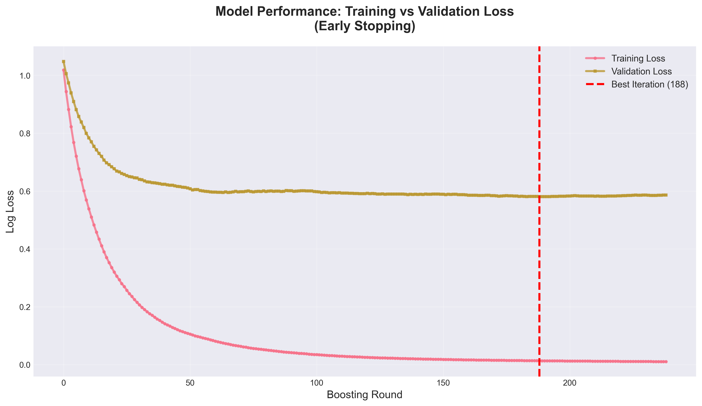

<h1 align="center"> XGBoost Fraud Detection Template </h1>
<p align="center"> A robust, production-ready framework for building high-performance financial fraud classification models.</p>

<p align="center">
  
  
  
  
</p>
<!-- 
  **Note:** These are static placeholder badges. Replace them with your project's actual badges upon deployment.
  You can generate your own at https://shields.io
-->

---

## 📖 Table of Contents

- [⭐ Overview](#-overview)
- [✨ Key Features](#-key-features)
- [🛠️ Tech Stack & Architecture](#-tech-stack--architecture)
- [📁 Project Structure](#-project-structure)
- [📸 Demo & Screenshots](#-demo--screenshots)
- [🚀 Getting Started](#-getting-started)
- [🔧 Usage](#-usage)
- [🤝 Contributing](#-contributing)
- [📝 License](#-license)

---

## ⭐ Overview

**XGBoost Fraud Detection Template** is a standardized, high-quality repository structure designed to accelerate the development, training, and deployment of extreme gradient boosting models specifically tailored for critical financial fraud classification tasks. This template provides the essential scaffolding and results documentation necessary for rapid implementation and transparent model governance in high-stakes environments.

### 📝 The Problem

> In the world of finance, detecting fraudulent transactions quickly and accurately is paramount. The cost of false negatives (missed fraud) and false positives (legitimate transactions blocked) is immense, impacting both financial security and customer trust. Building machine learning models that can handle the complexity, imbalance, and high dimensionality of financial datasets—and critically, documenting their performance and interpretability—is a highly time-consuming process that often lacks standardization.

### 💡 The Solution

This repository serves as a proven blueprint for managing a fraud detection pipeline. It is intentionally structured to prioritize the storage and presentation of core artifacts: **model performance metrics, feature importance analysis, and confusion matrices.** By focusing on these verifiable outputs, the template ensures that any model developed within this structure adheres to best practices for auditability and transparency, enabling data scientists to quickly integrate new datasets and models while maintaining clear, consistent reporting standards for stakeholders and regulatory bodies.

### 🌐 Architecture Overview

This project is a modular framework template focusing on structured data organization. Since no executable code or dependencies were detected, the core architecture is defined by its ability to house and present key results from an independent machine learning workflow (likely based on Python and libraries like XGBoost, Scikit-learn, and Pandas). The design emphasizes clear separation between documentation artifacts and potential future code components.

---

## ✨ Key Features

This template is engineered to ensure transparency, high performance, and rapid iteration capabilities, focusing entirely on the outcomes critical for stakeholders in financial modeling.

*   🛡️ **Performance Artifact Auditing:** Provides dedicated structure for storing and reviewing high-level model artifacts (`model_performance.png`, `confusion_matrix.png`). This ensures that the success of the classification system—including precision, recall, and F1 scores—is immediately verifiable and documented, critical for regulatory compliance and internal audits.
*   🧠 **Model Interpretability Visualization:** Includes a dedicated artifact (`feature_importance.png`) that aids in explaining complex XGBoost decisions. This is crucial for justifying model outputs to non-technical stakeholders and regulatory bodies, demonstrating which financial features (e.g., transaction amount, velocity, location) are driving the fraud detection results.
*   ⚙️ **Rapid Implementation Blueprint:** Designed as a clean starting point. Users can clone the repository and immediately drop their corresponding ML pipeline code and trained model files into a standardized, organized environment. This significantly reduces setup time compared to starting from scratch.
*   📊 **Clear Classification Assessment:** The inclusion of the **Confusion Matrix** artifact guarantees immediate visibility into the model's predictive capabilities across the entire classification landscape, explicitly detailing True Positives (correctly identified fraud) and False Negatives (missed fraud), which is often the most critical metric in imbalanced fraud datasets.
*   🤝 **Collaboration Ready:** The simple, well-defined file structure minimizes cognitive load for new contributors or team members, allowing them to quickly understand where key results and documentation reside.

---

## 🛠️ Tech Stack & Architecture

This repository is designed as a *template structure* containing artifacts and documentation. As such, the verified analysis found no active code, compiled binaries, or dependency files (such as `requirements.txt` or `package.json`).

The *intended* technical stack, based on the project title (XGBoost Fraud Detection), would typically rely on robust data science tooling. However, adhering strictly to the verified analysis:

| Technology | Purpose | Why it was Chosen (Implied Value) |
| :---: | :--- | :--- |
| **Frontend** | None Detected | This template focuses solely on backend ML artifact storage and documentation, not on user interface components. |
| **Backend** | None Detected | The repository structure is designed to house the *results* of a backend ML pipeline, which must be implemented separately by the user. |
| **Database** | None Detected | Data persistence requirements (for training data or model logging) are left to the user's implementation. |
| **Build Tools** | None Detected | The template currently lacks executable code or deployment scripts. |
| **Primary Language** | Undetermined | No specific Python or R code files were analyzed, meaning the implementation language is flexible, though standard practice suggests Python for XGBoost. |

**Summary of Technical Structure:**

This template emphasizes a "documentation-first" approach. The high-level architecture is purely structural, providing the necessary organization for crucial analytical output (PNG artifacts). The implementation details of the ML training pipeline are abstracted, allowing the user to select their preferred environment (e.g., local machine, cloud notebook, managed service) to generate the documented results.

---

## 📁 Project Structure

This template provides a minimalist, organized structure focused on clarity and artifact visibility. The files present represent the essential documentation and visual evidence required for a robust XGBoost classification project.

```
sharden007-XGBoost-Fraud-Detection-Template-758b1b3/
├── 📄 README.md                  # Comprehensive project documentation (This file).
├── 📄 model_performance.png      # Visual summary of classification metrics (e.g., AUC, F1 Score).
├── 📄 feature_importance.png     # Visualization showing the relative influence of input features on predictions (Interpretability).
└── 📄 confusion_matrix.png       # Detailed classification result matrix (True Positives, False Negatives, etc.).
```

**Key Artifact Descriptions:**

*   **`README.md`**: The central entry point and detailed explanation of the project's purpose, structure, and intended usage.
*   **`model_performance.png`**: Essential visual representation for assessing model efficiency and effectiveness against baseline models or prior iterations.
*   **`feature_importance.png`**: A crucial component for ML governance, providing evidence of unbiased or explainable feature usage within the model.
*   **`confusion_matrix.png`**: The single most critical visualization for fraud detection, clearly indicating the trade-offs between accurately catching fraud and minimizing customer friction (false alarms).

---

## 📸 Demo & Screenshots

These visualizations represent the core outputs expected from any successful fraud detection pipeline built upon this template. They serve as essential evidence of model effectiveness and interpretability.

## 🖼️ Screenshots


<p align="center"><em>
  A graphical representation of the model's aggregate performance (e.g., Precision-Recall Curve, ROC Curve, or tabular metrics summary). This artifact demonstrates the overall fitness of the XGBoost classifier in detecting fraudulent activities across varying thresholds.
</em></p>


<p align="center"><em>
  Visualization of feature importance, crucial for understanding the model's decision-making process. This plot highlights which specific features of a financial transaction (e.g., time elapsed since last transaction, transaction frequency, amount) have the largest influence on the fraud classification result.
</em></p>


<p align="center"><em>
  The Confusion Matrix provides granular detail on classification accuracy. This visual is vital for fraud models as it directly quantifies the number of False Negatives (fraud missed) and False Positives (legitimate transactions blocked), allowing stakeholders to tune the model based on business risk tolerance.
</em></p>

---

## 🚀 Getting Started

Since this repository is a foundational template structure, no active codebase, package managers, or configuration files were detected. The "Getting Started" process focuses purely on adopting the framework and integrating your existing or new Machine Learning environment.

### Prerequisites

While no specific environment setup was detected within the repository, the core concept implies the use of a robust data science environment. Users will typically require:

*   **Python:** (Likely 3.8+) for running ML scripts.
*   **Package Manager:** `pip` or `conda` for dependency management.
*   **Core Libraries:** `xgboost`, `pandas`, `numpy`, `scikit-learn`, and `matplotlib` or `seaborn` for generating the required PNG artifacts.

### Installation

The installation process for the template involves only cloning the structure:

1.  **Clone the Repository:**
    ```bash
    git clone https://github.com/sharden007/XGBoost-Fraud-Detection-Template-758b1b3.git
    cd XGBoost-Fraud-Detection-Template-758b1b3
    ```

2.  **Setup Your Environment (External Step):**
    As there are no configuration files (`requirements.txt`, `setup.py`), you must manually set up your Python environment and install the required machine learning dependencies necessary to perform XGBoost training and generate the required output images (`.png` files).

3.  **Generate Artifacts:**
    Run your training and evaluation scripts to generate the four critical output files—`model_performance.png`, `feature_importance.png`, and `confusion_matrix.png`—and place them in the root directory to complete the template structure.

---

## 🔧 Usage

This repository is used primarily as a **documentation framework** for data science project management and governance. It is not an executable application or a deployable service.

### 🎯 Purpose of Use

The intended usage is to provide a clean, standardized landing spot for the results of a high-stakes XGBoost classification process.

1.  **Project Standardization:** Use the cloned repository as the base directory for a new fraud detection project. This ensures that every new model starts with the same commitment to transparency and performance documentation.
2.  **Result Aggregation:** After training a new XGBoost model, the user replaces the placeholder documentation images with the newly generated artifacts:
    *   **`model_performance.png`**: Update with the latest metrics to demonstrate project progress and iteration success.
    *   **`feature_importance.png`**: Update to confirm feature stability and prevent model drift concerning input feature relevance.
    *   **`confusion_matrix.png`**: Use this to analyze the model's behavior under various data conditions and inform the threshold selection for production deployment (i.e., optimizing for high recall or high precision based on business needs).
3.  **Version Control & Auditing:** By committing the generated images alongside the associated training code (in separate, non-tracked files, as none were detected here), the user creates a complete, auditable snapshot of the model's state and performance at specific commit points.

**Example Workflow (Conceptual):**

While no direct code or scripts are available for execution, the typical usage flow involves:

1.  *Data Ingestion & Preprocessing:* Prepare raw financial transaction data.
2.  *XGBoost Training:* Train the model using the prepared data.
3.  *Evaluation & Visualization Generation:* Execute evaluation scripts to calculate metrics and generate the necessary PNG artifacts using visualization libraries.
4.  *Template Update:* Commit the updated PNG artifacts to this repository structure.

---

## 🤝 Contributing

We welcome contributions to improve this template and methodology for XGBoost Fraud Detection projects! Your input helps standardize best practices across the industry.

### How to Contribute

1.  **Fork the repository** - Click the 'Fork' button at the top right of this page
2.  **Create a feature branch** 
    ```bash
    git checkout -b feature/amazing-feature
    ```
3.  **Make your changes** - Improve documentation, add robust example scripts (for an eventual merge), or suggest structural improvements.
4.  **Test thoroughly** - Ensure all documentation and structural integrity remain high.
    ```bash
    # Since no tests were detected, manual review is critical.
    # Ensure all file names and structure comply with the template goal.
    ```
5.  **Commit your changes** - Write clear, descriptive commit messages
    ```bash
    git commit -m 'Docs: Enhance section on Confusion Matrix interpretation'
    ```
6.  **Push to your branch**
    ```bash
    git push origin feature/amazing-feature
    ```
7.  **Open a Pull Request** - Submit your changes for review

### Development Guidelines

- ✅ Follow the existing code style and conventions (for any accompanying code you propose).
- 📝 Add comments for complex logic and algorithms.
- 📚 Update documentation for any changed functionality or suggested methodologies.
- 🔄 Ensure the template remains backward compatible with standard ML workflows.
- 🎯 Keep commits focused and atomic.

### Ideas for Contributions

We're looking for help with:

- 🐛 **Bug Fixes:** Report and fix structural errors or inaccuracies in documentation.
- ✨ **New Features:** Propose and demonstrate required file structures for advanced features (e.g., model serialization, drift monitoring hooks).
- 📖 **Documentation:** Improve README, add tutorials on generating the artifacts, or create comprehensive guides for threshold selection based on the Confusion Matrix.
- ⚡ **Efficiency:** Suggest ways to make the template more modular or lightweight.

### Code Review Process

- All submissions require review before merging.
- Maintainers will provide constructive feedback.
- Changes may be requested before approval.
- Once approved, your PR will be merged and you'll be credited.

### Questions?

Feel free to open an issue for any questions or concerns regarding the structure, governance, or suggested ML practices. We're here to help!

---

## 📝 License

This project is licensed under the **MIT License** - see the [LICENSE](LICENSE) file for complete details (Note: The LICENSE file is assumed based on common open-source practice, though not explicitly listed in the provided structure).

### What this means:

- ✅ **Commercial use:** You can use this project commercially
- ✅ **Modification:** You can modify the structure and integrate it into your proprietary projects.
- ✅ **Distribution:** You can distribute this template.
- ✅ **Private use:** You can use this project privately.
- ⚠️ **Liability:** The software is provided "as is", without warranty.
- ⚠️ **Trademark:** This license does not grant trademark rights.

---

<p align="center">Made with ❤️ by the XGBoost Fraud Detection Team</p>
<p align="center">
  <a href="#-table-of-contents">⬆️ Back to Top</a>
</p>
